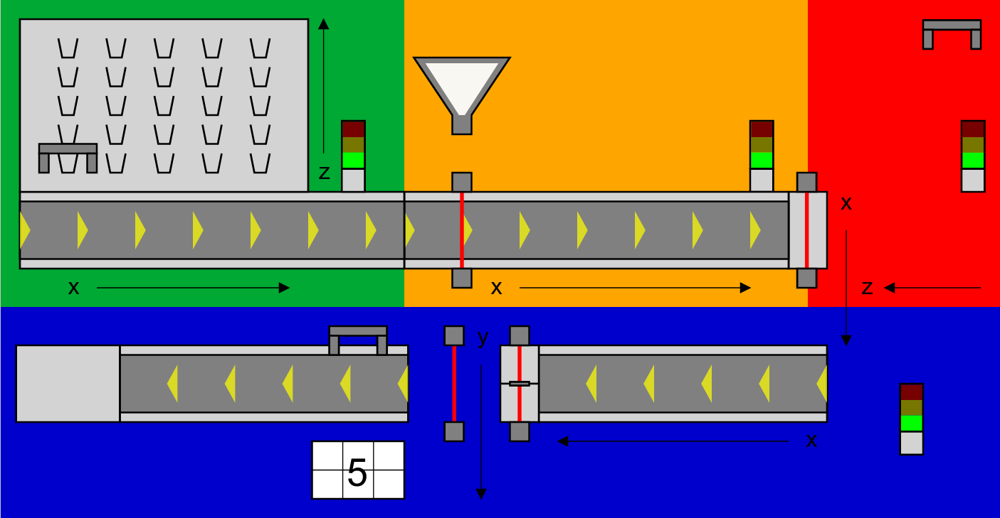

# AI4industry Hackathon GUI

This GUI allows each group to visualize the status of their simulation during the AI4industry Summer School Hackathon. You cannot control your factory via the GUI, but you can monitor its state for debugging and analysis.



## Prerequisites

Java, Node.js and npm are required to run the project.

## Installation

Open a terminal and clone the repository:

```
git clone https://gitlab.emse.fr/ai4industry/ai4industry2024-gui
```
 
Go to the `ai4industry2024-gui/` folder and run the script to launch the GUI with the command `./startGUI N`. Replace `N` with your assigned number `1-8` of the simulation.

```
cd ai4industry2024-gui/
./startGUI N
```

Once initiated, open your browser and go to: http://localhost:3000
